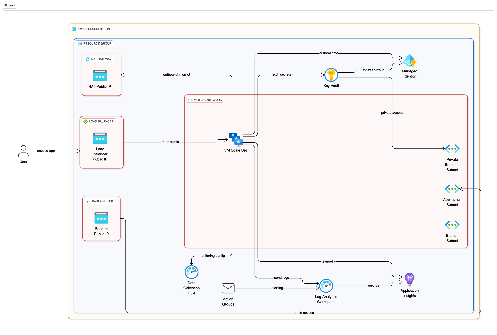

# siem-poc# Introduction 
The project is to create a highly available, secure and scalable solution for hosting web application in VM using nginx

# High Level Steps

1.	Designing and Implementing Core Infrastructure
2.	Configuring Web Application
3.	Integration for Operational Excellence
4.	Deploying the solution using Azure DevOps

# Architecture:

# Implementation:

1. Using Virtual Machine Scale Sets with autoscaling for hosting the web application spread across availaility zones behind Azure Load Balancer with external facing Frontend Configuration to route the traffic to Backend

2. Configuring web application using Cloud-init for automatic deployment and configuration

3. Restricting Outbound access from VM's using NAT Gateway and Inbound access to VM's using NSG, Bastion and LB

4. Integrating Key Vaults with Private Endpoints for secure retrival of secrets and certificates and using Managed Identities

5. Integrating with Azure Monitor and Log Analaytics Workspace for Monitoring and Alerting

6. Building CI\CD pipelines to deploy the solution to Azure using Azure Devops with Approval Gates and Quality Checks

